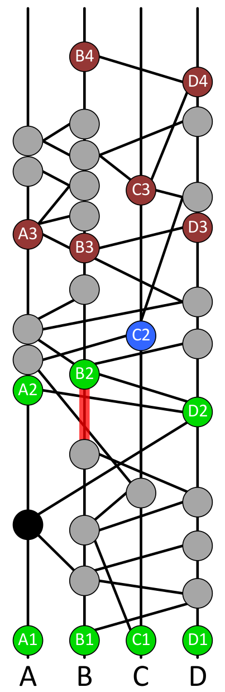

Hashgraph
===

## The Future of Decentralized Technology

---

# Byzantine Generals Problem

- A commanding general must send an order to his $n-1$ lieutenant generals such that
  - All loyal lieutenants obey the same order
  - If the commanding general is loyal, then every loyal lieutenant obeys the order he sends

---

# Byzantine Generals Problem

- distributed systems need to deal with failure or conflicting behaviours of its components
- fun fact: *Lamport: "I have long felt that, because it was posed as a cute problem about philosophers seated around a table, Dijkstra's dining philosopher's problem received much more attention than it deserves."*

---

# Asnchronous Byzantine Fault Tolerance (BFT)

- What does Byzantine mean?
  - will reach consensus
  - know when consensus reached
  - consensus never changes
- assumptions
  - attacker controls < 1/3 (theoretical limit)
  - attacker controls the network
    - messages between honest nodes eventually get through
    - asynchronous BFT -> no assumptions on the timing

---

# Can Bitcoin tolerate 1/3 attacker nodes?

---

# Distributed Consensus Algorithms

- Proof-of-work (Bitcoin, Ethereum)
  - slow (10 transactions per second)
  - waste of energy ($1M/day ~ Mauritius energy consumption)
- Proof-of-stake (Ethereum Casper)
  - much lower energy consumption
- Leader-based (Hyperledger Fabric)
  - Paxos, Raft, PBFT
- Voting-based (no implementation)
  - excellent theoretical properties
  - high bandwidth requirements $O(n^2)$

---

# What is hashgraph?

Hashgraph is a data structure and consensus algorithm that is:

- Fast: With a very high throughput and low consensus latency
- Secure: Asynchronous Byzantine fault tolerant
- Fair: Fairness of access, ordering, and timestamps

These properties enable new decentralized applications such as a stock market, improved collaborative applications, real-time games, and auctions.

---

---

# Interesting characteristics

- absolute confirmation of transactions (unlike proof of work)
- order of transactions preserved (compare with proof of work where transaction order is determined by miners)
- no wasted computation (compare with blockchain forking)
- just gossip and everything will work (low overhead)
- really fast (no additional comms for consensus)

---

---

# The consensus algorithm

Refer to [Hashgraph graphical example](graphical.pdf)

---

---

Randomly pick someone to gossip with

---

---

---

---

---

---

---

---

---

---

---

---

# Intuition of how hashgraph works

- order transactions by the time a majority of the nodes learns about it (thru the gossips)
  - must be 2/3 or more, received by 50% is not good enough when 1/3 are attackers
- what are witnesses for? some kind of optimization to save computations
- what is strongly seeing for? to protect against forking

---

# References and recommeded reading

The Byzantine Generals Problem
http://research.microsoft.com/users/lamport/pubs/pubs.html#byz

How Hashgraph Works (Graphically)
http://www.swirlds.com/downloads/SWIRLDS-TR-2016-02.pdf

Hashgraph security and attack resilience
https://www.youtube.com/watch?v=pcToFASnyrc

Deconfusing Decentralization
https://youtu.be/7S1IqaSLrq8

Hashgraph introduction at TechCrunch Disrupt
https://youtu.be/ZrFrXFdRW4k

Leemon Baird x Havard Talk
https://youtu.be/IjQkag6VOo0

---

# References and recommended reading

Beginner's Guide to Ethereum Casper Hardfork
https://blockonomi.com/ethereum-casper/

Ethereum Proof of Stake FAQ
https://github.com/ethereum/wiki/wiki/Proof-of-Stake-FAQ

A (Short) Guide to Blockchain Consensus Protocols
https://www.coindesk.com/short-guide-blockchain-consensus-protocols/

Proof of Activity: Extending Bitcoin's Proof of Work via Proof of Stake
https://eprint.iacr.org/2014/452.pdf