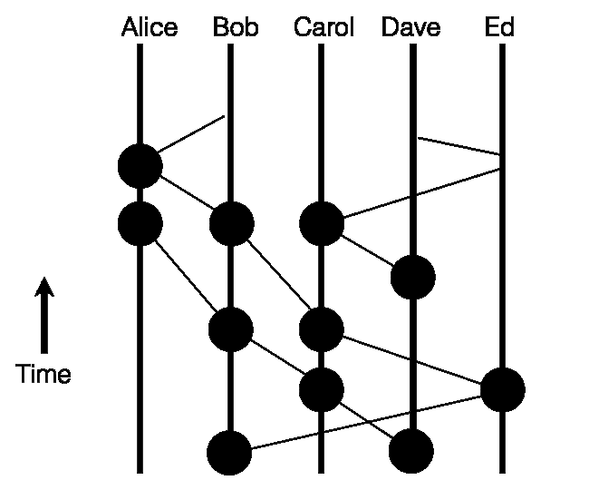
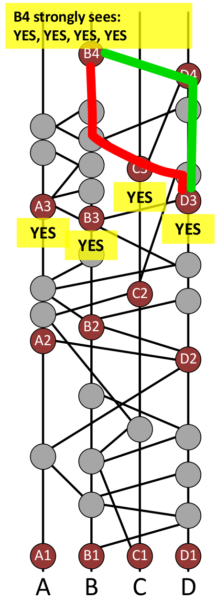

Hashgraph
===

## The Future of Decentralized Technology

---

# Byzantine Generals Problem

- A commanding general must send an order to his $n-1$ lieutenant generals such that
  - All loyal lieutenants obey the same order
  - If the commanding general is loyal, then every loyal lieutenant obeys the order he sends

---

# Byzantine Generals Problem

- distributed systems in real life
  - need to deal with failure or conflicting behaviours of its components
  - need consensus on the distributed state
- fun fact: *Lamport: "I have long felt that, because it was posed as a cute problem about philosophers seated around a table, Dijkstra's dining philosopher's problem received much more attention than it deserves."*

---

# Asnchronous Byzantine Fault Tolerance (BFT)

- What does Byzantine mean?
  - will reach consensus
  - know when consensus reached
  - consensus never changes
- Assumptions
  - attacker controls < 1/3 (theoretical limit)
  - attacker controls the network
    - messages between honest nodes eventually get through
    - asynchronous BFT -> no assumptions on the timing

---

# Can Bitcoin tolerate 1/3 attacker nodes?

---

# Distributed Consensus Algorithms

- Proof-of-work (Bitcoin, Ethereum)
  - slow (10 transactions per second)
  - waste of energy ($1M/day ~ Mauritius energy consumption)
- Proof-of-stake (Ethereum Casper)
  - much lower energy consumption
- Leader-based (Hyperledger Fabric)
  - Paxos, Raft, PBFT
- Voting-based (no implementation)
  - excellent theoretical properties
  - high bandwidth requirements $O(n^2)$

---

# What is hashgraph?

Hashgraph is a data structure and consensus algorithm that is:

- Fast: With a very high throughput and low consensus latency
- Secure: Asynchronous Byzantine fault tolerant
- Fair: Fairness of access, ordering, and timestamps

These properties enable new decentralized applications such as a stock market, improved collaborative applications, real-time multiplayer games, and auctions.

---

---

# Interesting characteristics

- absolute confirmation of transactions (unlike proof of work)
- order of transactions preserved (compare with proof of work where transaction order is determined by miners)
- no wasted computation (compare with blockchain forking)
- just gossip and everything will work (low overhead)
- really fast virtual voting (no additional comms for consensus)

---

---

# The consensus algorithm

Refer to [Hashgraph graphical example](graphical.pdf)

---

---

Randomly pick someone to gossip with to create <strong>events</strong>

---

---

Events are divided into <strong>rounds created</strong>

First event from each member in each round are <strong>witnesses</strong>

---
### voting on <strong>fame</strong> by next round witnesses (<strong>seeing</strong>)

---
### vote counting by next round witnesses (<strong>strongly seeing</strong>)

---

B2 is decided to be <strong>famous</strong>

---

Of all the round 3 witnesses, only C3 can see C2

---

B4 can strongly see all 4 votes, and decides that C2 is not famous

But assuming B4 wasn't able to strongly see a <strong>supermajority</strong> of the same votes, it will fail to decide the result, and will vote based on the majority of its collected votes, and leave it to other witnesses to decide (potentially from future rounds).

---

Similarly, elections are conducted for the other witnesses as well

Once the fame of all witnesses in a round is decided, we can use that to find the consensus ordering of another set of events

---

Black event seen by all famous witnesses, so round received of 2

Doesn't matter that C2 can't see it, as C2 is not famous

---

For events not seen by all famous witnesses, wait for the next round

---

For Consensus order, sort by:

<ol>
<li>Round received</li>
<li>Consensus timestamp (median of first received timings by creators of famous witnesses)
<li>Whitened signature (signature XOR with signatures of all famous witnesses)
</ol>

---

The example was adapted from an actual run with 4 members

---

# Intuition of how hashgraph works

- order transactions by the time a majority of the nodes learns about it (thru the gossips)
  - must be 2/3 or more, received by 50% is not good enough when 1/3 are attackers
- famous witnesses are like well-known and trusted events, and simplifies the computation
- strongly seeing protects against forking, so no attacker can cheat by creating multiple famous witnesses in a single round

---

# References and recommended reading

The Byzantine Generals Problem
http://research.microsoft.com/users/lamport/pubs/pubs.html#byz

How Hashgraph Works (Graphically)
http://www.swirlds.com/downloads/SWIRLDS-TR-2016-02.pdf

Hashgraph security and attack resilience
https://www.youtube.com/watch?v=pcToFASnyrc

Deconfusing Decentralization
https://youtu.be/7S1IqaSLrq8

Hashgraph introduction at TechCrunch Disrupt
https://youtu.be/ZrFrXFdRW4k

Leemon Baird x Havard Talk
https://youtu.be/IjQkag6VOo0

---

# References and recommended reading

Beginner's Guide to Ethereum Casper Hardfork
https://blockonomi.com/ethereum-casper/

Ethereum Proof of Stake FAQ
https://github.com/ethereum/wiki/wiki/Proof-of-Stake-FAQ

A (Short) Guide to Blockchain Consensus Protocols
https://www.coindesk.com/short-guide-blockchain-consensus-protocols/

Proof of Activity: Extending Bitcoin's Proof of Work via Proof of Stake
https://eprint.iacr.org/2014/452.pdf