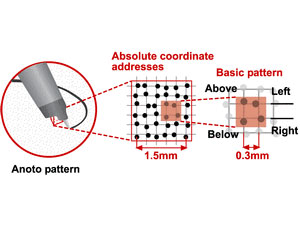
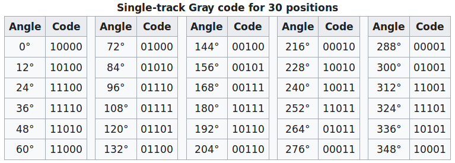
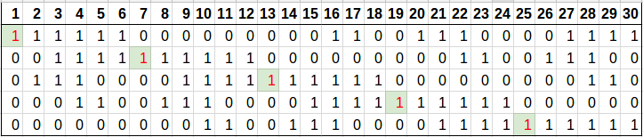
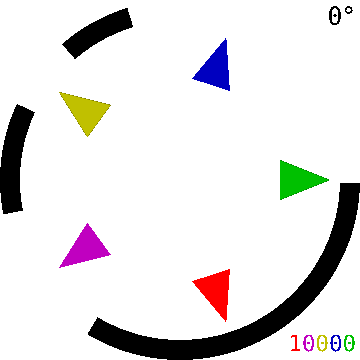

The secret of magic paper (revealed!)
===

---

# "Any sufficiently advanced technology is indistinguishable from magic."

### - Arthur C. Clarke

---

---

# live demo

- leap reader
- yidubao
- eTutorStar
- piano

---

# How might we do this?

- ### Pen with a camera + OCR + text-to-speech

---

# How might we do this?

- Pen with a camera + OCR + text-to-speech
- ### High-precision "GPS" on the pen tip

---

# How might we do this?

- Pen with a camera + OCR + text-to-speech
- High-precision "GPS" on the pen tip
- ### QR codes on every inch of the paper

---

# In conclusion, it must be magic.

---

`// cue to distribute magic paper`

---

# Anoto Dot Pattern (Sample zoom-in)

---

# Anoto Dot Pattern

---

# How big an area can this pattern cover?

- 36 dots = $2^{36}$ variations in one axis
- distance in one axis = $2^{36}$ * 0.3 $mm$ = 20,000 $km$
- you might think it can cover an area of 400 million $km^2$
- in practise, roughly the size of Asia and Europe combined

---

# Gray Code

| Decimal | Binary | Gray |
|-|-|-|
| 0 | 000 | 000 |
| 1 | 001 | 001 |
| 2 | 010 | 011 |
| 3 | 011 | 010 |
| 4 | 100 | 110 |
| 5 | 101 | 111 |
| 6 | 110 | 101 |
| 7 | 111 | 100 |

---

# Single-track Gray Code

---

# Single-track Gray Code

---

# Single-track Gray Code

- Consider this sequence `00001111000`
- Each consecutive 4 bits is different, so you just need to look at 4 bits in the sequence to know exactly where you are
- Now imagine a super long version of this sequence, you just need to look at a short segment to know exactly where you are in one direction
- Now extend this to 2 dimensions, and the **magic** happens

---

# References and recommended reading

- A brief technical introduction to Anoto technology
http://freedot.sourceforge.net/

- Gray code
https://en.wikipedia.org/wiki/Gray_code

- The Structure of Single-Track Gray Codes
http://www.ee.bgu.ac.il/~schwartz/publications/MSjrnl1.pdf

- Single-Track Circuit Codes
http://www.hpl.hp.com/techreports/2000/HPL-2000-81.pdf

- LiveScribe Smartpen: Piano
https://www.youtube.com/watch?v=0eoiOOfGxLY