Typing at the speed of thought
===
Do you type as fast as you think?

---

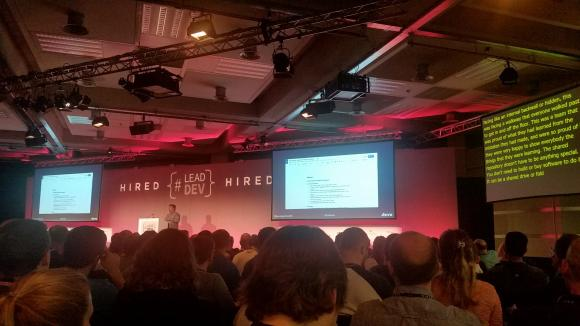

---

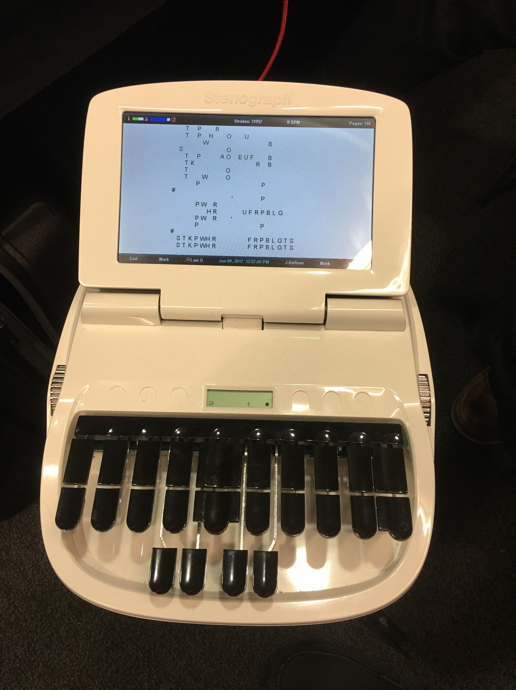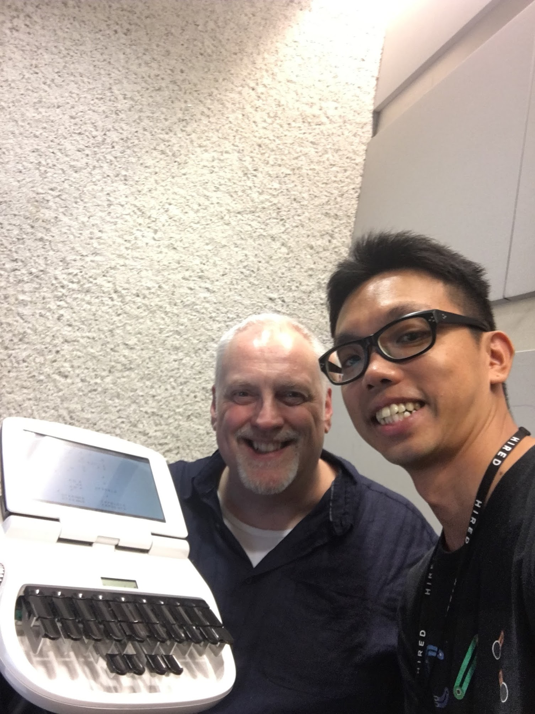

---

## What is stenography?

- press key chords instead of individual keys (e.g. KAT for cat)
- phonetic/mnemonic instead of spelling
- your fingers *almost* never leave the "home position"
- only 22 keys!
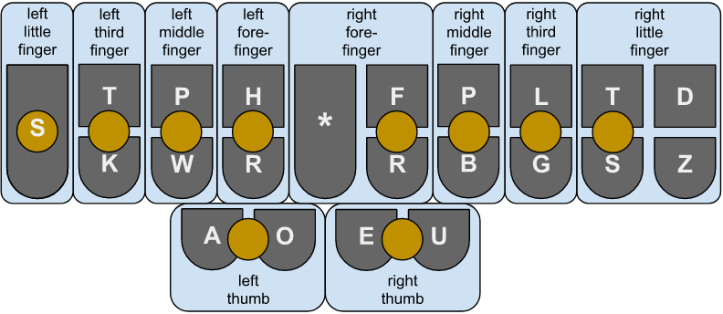

---

## What is steno?

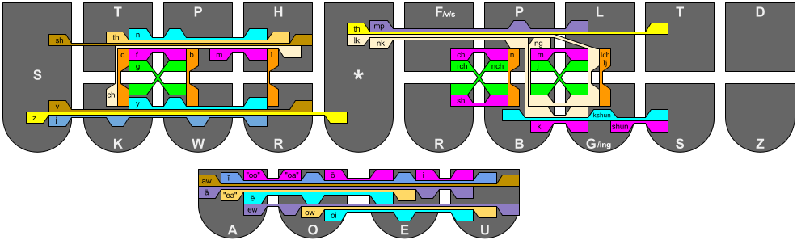

---

## History of steno

- first stenotype was invented in 1879
- is the typing version of shorthand writing
- mostly used in courtrooms
- expensive hardware, software and training
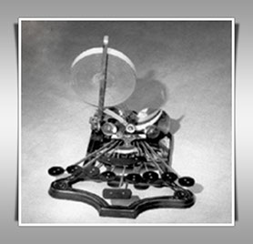1879 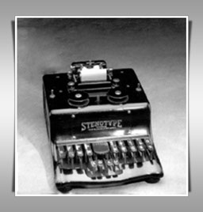1911

---

## History of steno

- steno paper

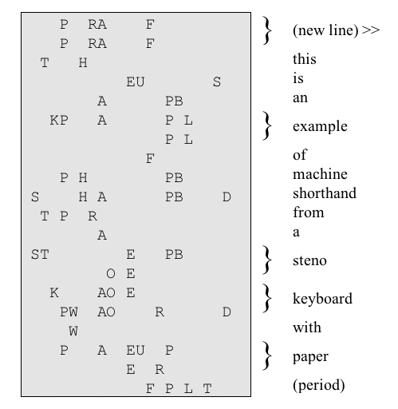

---

## Why steno?

- speed
  - average typist = 40wpm
  - top QWERTY typist = 120wpm
  - speech = 180wpm
  - steno students = 100-120wpm (in 6mths)
  - certified stenographer = 240wpm @ 99.9% accuracy
  - world record = 360wpm @ 97.23% accuracy
- ergonomics
  - fingers mostly at home position
  - even better than DVORAK and COLEMAK
- makes your brain work faster?
  - same as what the abacus does for mental arithmetic

---

## How do you type _________?

- a quick brown fox jumps over the lazy dog
- `AEU KWEUBG PWROUPB TPOBGS SKWR*UPLS OEFR -T HRAEZ TKOG`

---

## How do you type _________?

- anagrams (post/stop/pots)
  - post = POEST, stop = STOP, pots = POTS 
- homophones
  - vowel disambiguators
    - road = RAOD, rode = ROED
    - pair = PAEUR, pear = PAER
  - chords for missing letters
    -  sight = SAOEUT, site = SAO*EUT, cite = KRAOEUT
- multi-syllabic words
  - python = pie + thon = PAOEU/THOPB
- dictionary, briefs
- for anything else, there's fingerspelling

---

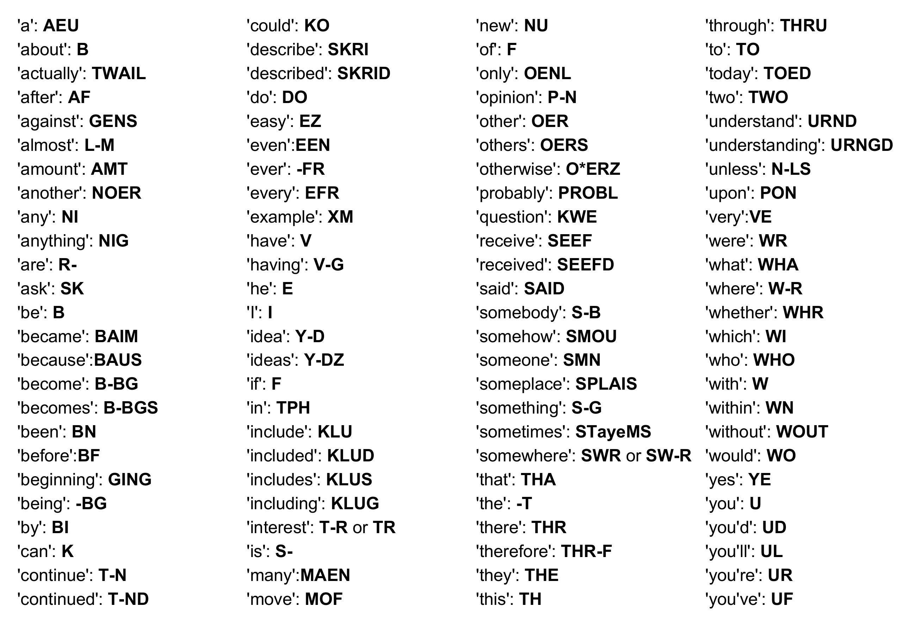

---

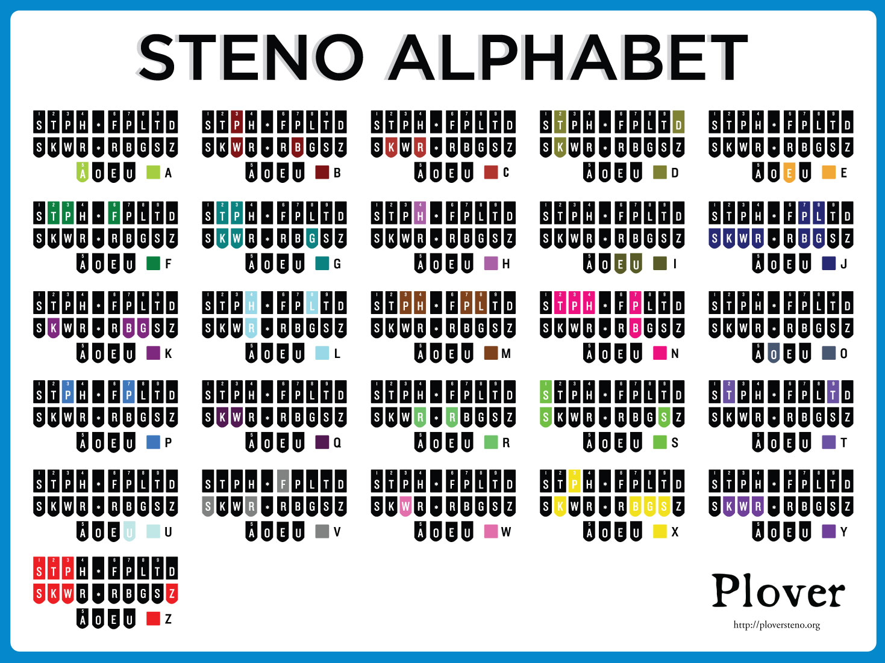

---

## Other interesting stuff

- FizzBuzz in JS (https://www.youtube.com/watch?v=RBBiri3CD6w)
- Longer code in Python (https://www.youtube.com/watch?v=jRFKZGWrmrM)
- Super fast typeracer (http://data.typeracer.com/pit/profile?user=stedno)

---

## Getting started with steno

- software
  - Plover (http://www.openstenoproject.org/plover/)
- hardware
  - NKRO keyboard
  - ortholinear keyboards (Planck, Gherkin, etc)
  - stenomod (https://stenomod.blogspot.com/)
  - specialized stenotype (Stenograph, Tréal, etc)
- books
  - https://sites.google.com/site/ploverdoc/home
  - https://www.gitbook.com/book/morinted/plover-theory/details
- community
  - https://discord.me/plover

---

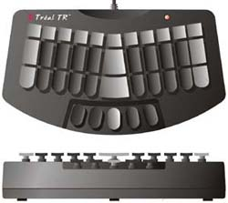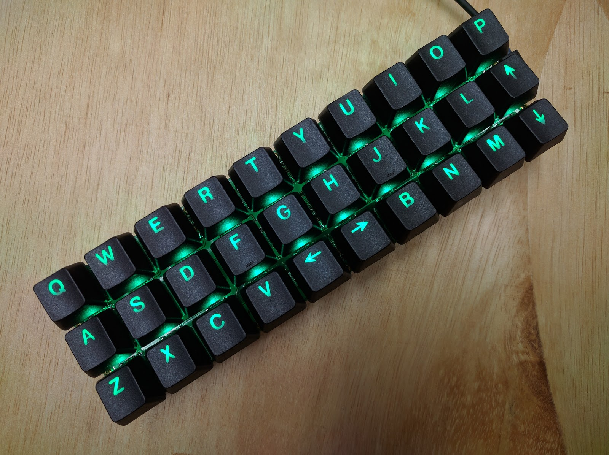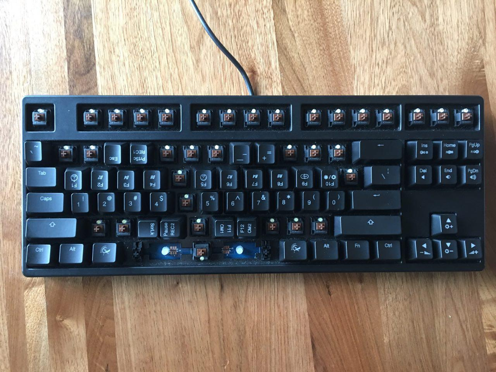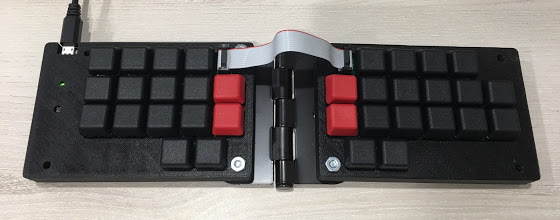

---

## References

- Learn Plover (https://sites.google.com/site/ploverdoc/)
- Open Steno Project (http://www.openstenoproject.org/)
- History of Writing Machines (http://www.stenograph.com/history-writers)
- World Record (http://www.guinnessworldrecords.com/world-records/fastest-realtime-court-reporter-(stenotype-writing))

---

## Questions?